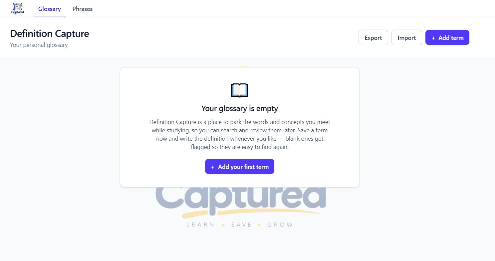

# Definition Capture

A small personal list of terms and concepts worth remembering. You sign in with
an emailed link, and your terms and phrases are private to your account.

## Running it

Double-click **`start-app.cmd`**. It installs dependencies the first time, starts the dev
server, and opens the browser for you. Keep the window open while you use the app; closing it stops the server. If the app is already running it just opens the browser again.

Or from a terminal:

```bash
npm install     # first time only
npm run dev
```

Then open <http://localhost:3001>.

Either way you need a `.env.local` first — copy `.env.example` and fill in the two Supabase
values. See [Setting up Supabase](#setting-up-supabase). Without them the app still builds and
runs, but says so instead of showing a sign-in form.

The port is fixed at 3001 on purpose: the sign-in link has to come back to an origin Supabase
has been told to accept, and `http://localhost:3001` is the one registered. Starting on another
port would bounce every magic link. The dev server also accepts requests from `192.168.0.11`,
which lets a phone on the same router load it — that address is DHCP-assigned, so re-check it
in `next.config.ts` if the router reassigns.

## Where the data lives

Both lists live in **Supabase** — Postgres tables `terms` and `phrases`, plus a
`user_settings` row per account for what Settings manages. One private set of
rows per signed-in account: sign in on any browser or device and the same list is there,
and a `/term?id=…` link opens anywhere you are signed in.

Every query runs in the browser. The app is a static export with no server process behind it,
so the only credential in play is the publishable key, which is compiled into the JavaScript
bundle and readable by anyone who views source. That is what that key is for — but it means
**row level security is the only thing separating one account's terms from another's.**
The policies in `supabase/migrations/` are load-bearing, not decoration; every table has RLS
enabled and four policies that check `auth.uid() = user_id`.

The two stores are built from one factory in `src/lib/remoteStore.ts` — nothing else in the
app talks to Supabase directly, so the lists cannot drift apart in how they load, save, or
report a failure. It keeps the shape the old `localStorage` store had: the whole list is
fetched once into memory and read synchronously, and a write updates the screen immediately
and goes to the database in the background. That is why adding a term still feels instant,
and why the forms never had to learn that saving became a network call.

The price of writing optimistically is that a failure lands after the edit is already drawn.
When that happens the store reloads the list so the screen shows what is really stored, and
`StoreErrorBanner` says what went wrong — losing a write silently would be worse than a
banner.

### The list you had before accounts

Earlier versions kept everything in `localStorage` under `definition-capture.entries.v1` and
`definition-capture.phrases.v1`. If a browser still holds those keys, signing in offers to
copy them into the account. The offer is two steps on purpose: the copy runs first, and the
old keys are only removed once you have looked at your list and pressed the second button —
deleting the only copy of that data on the strength of a request whose outcome nobody has
seen yet would be careless. `src/lib/legacyLocal.ts` is the read-only reader for those keys,
and it is the only place left that touches them.

## What a term holds

| Field | Notes |
| --- | --- |
| **Term** | Required, plain text. |
| **Definition** | Optional — leave it blank and fill it in later. |
| **Ref** | Optional free text that links itself — see below. |
| **Category** | Up to three groups the term belongs to, e.g. Nature or Office. Optional. |
| **Source** | Dropdown of your own list, `Manual` / `Google` / `Claude` / `ChatGPT` to begin with. |
| **Date Added** | Set once on creation, never editable. |
| **Date Updated** | Set on every save, shown on the term's own page as "Edited …". Null until the first edit. |
| **Needs Definition** | Derived automatically — true whenever the definition is blank. |

The Source and Category options are yours to edit, under **Settings**. Both lists are
kept per account in `public.user_settings`, so they follow you between devices; the
arrays in **`src/lib/constants.ts`** are only what an account starts with before it has
changed anything.

Taking a name off either list never reaches back into what is already saved. A term
filed under a removed category keeps it — it still shows, still filters, and is still
offered while you edit that term — and a term whose source has been removed keeps that
too. What changes is only what is suggested for new ones.

## Pages

- **`/`** — the landing page. A heading and nothing on it yet.
- **`/terms`** and **`/phrases`** together make up **Glossary**, one section with two
  views. The grouping lives entirely in the nav — see below — so both keep their own
  addresses, neither list knows about the other, and nothing about how they store or
  read their rows changed.
- **`/terms`** — the **Terms** page, which owns adding, editing, and deleting terms.
  Columns are Term, Definition, Category, Source, and Ref. Search covers terms,
  definitions, and refs; a category dropdown narrows the list to one group, and clicking
  a category pill on any row does the same thing without leaving the list; a "Needs
  definition" checkbox narrows to unfinished entries; the Term, Definition and Source
  headers re-sort. A table on laptops, cards on phones. Rows that need a
  definition are flagged in amber. Date Added is not a column — the list is alphabetical
  by term, and a leading `der`, `die`, or `das` is skipped when comparing, so a term
  filed under its article sorts by the word that follows instead. Date added survives
  as the tie-breaker, and the date itself is shown on the entry's own page.
- **`/phrases`** — the phrase list: a separate store that mirrors Terms, for multi-word
  expressions that do not fit a single term. Columns are **Phrase**, **Literal Meaning**,
  **Usage Example**, and **Ref** — no dates, since phrases are looked up by wording rather
  than by when they were captured. Search covers all four fields, the Phrase and Literal
  Meaning headers each cycle A→Z / Z→A / back to newest-first, and only Phrase is
  required.
- **`/term?id=…`** and **`/phrase?id=…`** — one item per stable URL, safe to reload or paste
  into a fresh tab. This is where a `[[Name]]` reference lands. Both pages read: they show the
  full untruncated text plus, for a term, its Source badge and dates, and offer **Edit** so a
  cross-link onto a typo can be fixed on the spot. Saving from here returns you to the list.
  Deleting is not offered — the lists own that. An unknown ID shows a readable "not found"
  message rather than an error page.

- **`/verbs`** — the conjugation tables, one per verb, each rolled up to its verb until
  you open it. Tables are made from a term's Edit screen rather than here, which is what
  keeps a table's name and its term the same word: the two are matched by name, the way
  `[[Name]]` links resolve. `?verb=arbeiten` opens that table; `?new=arbeiten` makes it
  first — asking who verbs conjugate for if that has never been answered — and then opens
  it. Both are what the Edit term screen links to.
- **`/grammar`** — a heading and nothing else yet.
- **`/settings`** — reached from the account menu at the right of the nav rather than
  from the tabs, which belong to the two lists. Four sections: **Profile** (the address
  you signed in with, an optional display name shown in the nav in its place, and Sign
  out), **Categories** and **Sources** (add, remove, and reorder the lists the term form
  offers — source order is the order the Source column sorts by, so it is kept rather
  than alphabetised), and **Export folder** (see Backup below). The first three are per
  account; the folder is per browser.

  Each section is rolled up to its name and what it is currently set to, with a pencil
  to open the controls. The two list sections show their name alone: spelling eight
  categories across a row meant to be skimmed would defeat the point of folding it up.

The id is a query parameter rather than a path segment because the app is exported as static
HTML (see Deploying): the ids only exist in each visitor's browser, so a `/terms/[id]` route
would have nothing to pre-render at build time. One static page that reads the id at runtime
works everywhere.

A thin nav bar at the top of every page carries the Captured logo in the top left corner
and switches between Glossary, Verbs, and Grammar. There is no Home tab — the logo is the
way home, and two controls for one destination is one too many. Each tab decides for
itself which paths light it up, so a `/term?id=…` or `/phrase?id=…` page keeps Glossary
lit.

Glossary is the two lists under one tab, and that tab opens a menu rather than going
anywhere: it stands for two pages, so navigating on click would mean quietly preferring
one of them. Terms and Phrases are the two items, the one you are on is marked, and the
menu closes on Escape — putting focus back on the tab — on a click outside, and on
choosing. The bar deliberately has no horizontal overflow: a scroll on one axis makes
the other one scroll too, which would clip the menu.

At the right-hand end are the signed-in name and a gear that opens Settings. Signing out
is in Settings rather than up here: it is rare and feels destructive, and one click from
a nav bar is closer than it wants to be. On a narrow screen the bar scrolls sideways
rather than wrapping into two rows.

The same logo sits behind the app as a backdrop, shaded 70%: the artwork is laid over the page
colour at 30% strength, which is the same thing as covering it with 70% of that colour but in
one layer instead of two. It is fixed rather than scrolling, so a long list slides over a still
backdrop, and the cards and headers above it stay opaque so every table row keeps full
contrast — the logo shows through the page margins. `--logo-shade` in the `PageBackground`
component in `src/app/layout.tsx` is the only number to change: raise it to fade the logo
further, lower it to bring the artwork forward.

Dates are shown short — `01 Sep 2026`, no clock time. Hovering shows the exact timestamp, and
sorting always uses the full stored value, so two terms added on the same day still order
correctly.

## Conjugation tables

A verb's conjugation lives on the Verbs page, and is started from the verb itself:
**Edit** the term and use **Conjugation table**. If that verb already has one, the same
place shows an icon that opens it instead — so the Edit screen answers "does this word have
a table yet?" either way.

Creating one goes straight to the table. The Edit screen only links to
`/verbs?new=<verb>`; the Verbs page does the work and the reader lands on the thing they
asked for, rather than on a confirmation telling them where to go next.

The first table asks who verbs conjugate for — `ich`, `du`, `er/sie/es`, and so on, one per
line — and it asks **on the Verbs page**, not in the term dialog: a question about verbs in
general does not belong inside a dialog about one word. That answer is kept in Settings and
used for every table after it, so it is asked once. Nothing sensible could be shipped as a
default: the language being studied is not the app's to assume. The list is editable later
under **Settings → Verb persons**; changing it shapes the next table made, and leaves
tables that already exist with the rows they were made with.

Each table is named for its verb and has a row per person, with a **Conjugation** column and
a notes icon. The icon opens a note for that row — filled in when there is one to read, an
outline when there is not — and notes are saved with the table. Saving folds the table away
again, so the page stays a list of verbs rather than a wall of conjugations.

The rows are one `jsonb` column rather than a second table. They are only ever read, written
and shown as one whole table — there is no query wanting one person's row across every verb
— so a child table would add a join to answer a question nobody asks, and an `order` column
to keep in step.

## Adding, editing, and deleting

Everything happens on the list pages, in a dialog, without navigating away.

- **Add** — the **Add term** / **Add phrase** button at the top right.
- **Edit** — select the term or phrase itself in the list. Every editable field lives in that
  one form, Source included; Date Added is preserved. Renaming onto a name another entry
  already uses is refused rather than leaving two identical entries.
- **Delete one** — the trash button at the end of the row, behind a confirmation.
- **Delete several** — tick the checkboxes (or the select-all box in the header), then use
  **Delete selected** in the bar that appears. The confirmation names what is about to go, up
  to six of them, then "…and N more".

Selection is always intersected with what is on screen, so a row you filter away leaves the
selection on its own — "Delete selected" can only ever delete rows you can actually see.

## The Ref field

Ref is free text, so a note like `Lecture 4, page 12` is perfectly valid. On top of that, five
patterns are recognised and turned into links, and you can mix them with ordinary words in one
field:

| Write | Links to |
| --- | --- |
| `[[Closure]]` | Whatever is saved under that name — a term **or** a phrase, since the two share one namespace. Terms win a name clash. A name that matches nothing is shown plainly rather than as a dead link. |
| `/term?id=abc123`, `/` | A page inside this app. |
| `https://example.com/docs` | Any web page — opens in a new tab. The scheme is hidden in the display so the column stays readable. |
| `www.example.com` | The same, with `https://` assumed. |
| `#definition` | A spot on the page you are already on. |

Wrapping punctuation is handled, so `(https://example.com).` links only the URL. Ref is
searchable along with the other fields on both lists, and it is included in backups.

## Backup: export and import

**Export** and **Import** sit at the top right of every screen, so there is always a copy you
hold yourself and a way out of the app entirely.

By default an export goes wherever the browser puts downloads. **Settings → Export
folder** lets you pick a folder instead, and both formats then write straight into it
under the same file names. The choice is remembered per browser rather than per account:
a folder is granted to one browser on one machine as a handle that cannot be written down
as text, so it lives in IndexedDB and cannot follow you to another device. Only Chromium
browsers can offer it at all — elsewhere the Settings page says so and exports keep going
to the download folder.

A folder that has been moved, deleted, or had its permission withdrawn stops the export
rather than silently redirecting it: the dialog says what went wrong and offers to pick
another folder, or to use the download folder for this one.

- **Export** asks two things: how much, and in what format.

  **How much** — *Everything* (both lists), or *Only this page*, which means Phrases while you
  are on the phrase list or a single phrase, and Terms everywhere else. The file name
  records the choice:
  `definition-capture-backup-…`, `-terms-…`, or `-phrases-…`.

  **What format** — either one covers whatever you chose above, in a single file:

  | Format | What you get |
  | --- | --- |
  | **Excel workbook** (`.xlsx`) | One sheet per exported list — Terms and Phrases when you export everything — with bold headers and sensible column widths. For reading, sorting, or printing outside the app. |
  | **JSON backup** (`.json`) | `{ format, version, exportedAt, entries, phrases }` — plain, readable, and **the only format Import can read back in**. |

  The button is disabled while there is nothing saved. The workbook is built in the browser by
  [`write-excel-file`](https://www.npmjs.com/package/write-excel-file), the app's one runtime
  dependency beyond Next and React.
- **Import** reads a backup back in. It first shows you what is in the file — how many items
  are new, how many you already have, and how many rows it could not read — then asks what to
  do:

  | Mode | Effect |
  | --- | --- |
  | Add only what I don't have | Default. New items are added, existing ones untouched. |
  | Add new and update matching | The backup overwrites what you have. |
  | Replace everything with this backup | What is saved now is deleted first — behind a second confirm. |

Terms match on the term, phrases on the phrase, both case-insensitively — the same rule the add
forms use. Imported entries keep their original **Date Added**, which is the point of a backup,
and IDs that would collide are quietly re-issued so nothing is overwritten by accident.

Older backups still work: a version 1 file (terms only) imports fine, as does a bare array of
entries. **Replace never wipes a list the file carries nothing for** — restoring a terms-only
export leaves your phrases alone, and a phrases-only export leaves your terms alone. The
confirmation spells out, per list, what will be deleted and what will be left as it is.
Anything unreadable is counted and reported rather than silently dropped.

## Handy behaviors

- **Paste-to-split.** Pasting `term: definition` or `term - definition` into the Term field
  splits it across both fields. It only fills Definition when that field is still empty, and
  leaves URLs and long sentences alone.
- **Duplicate check.** A term is saved once. Saving one that already exists
  (case-insensitively) offers to update it, or to go back and change the wording — there
  is no “keep both”, because there cannot be: the unique index on `(user_id, lower(term))`
  refuses a second, and `[[Name]]` links, the duplicate check itself, and import matching
  all resolve a name to exactly one entry. Phrases work the same way.
- **Tabs catch up when you look at them.** Switching to another tab, or back to the window,
  re-reads both lists from the database, so a term added elsewhere is there when you look.
  It is not live sync — a second tab sitting visible next to the first will not update until
  it is focused. The `localStorage` version got true cross-tab updates free from the
  `storage` event; a database has no equivalent, and Supabase Realtime would mean enabling
  replication for a payoff this app does not really need.

## Setting up Supabase

One project holds both tables. From a clean checkout:

```bash
npx supabase login                              # opens a browser; needs a real terminal
npx supabase link --project-ref <your-ref>      # the ref is in the dashboard URL
npx supabase db push                            # applies supabase/migrations/
```

Then, in the dashboard:

- **Project Settings → API** — copy the project URL and the publishable key into `.env.local`.
- **Authentication → URL Configuration → Redirect URLs** — add both
  `http://localhost:3001/` and `https://liezljvv74.github.io/definition-capture/`. A magic
  link that comes back to an unlisted URL is silently redirected to the site root, which
  looks exactly like a broken link.

Sign-in is a one-time emailed link, so there is no password anywhere in the app and no
sign-up step — Supabase creates the account on the first link it sends.

The client asks for the **implicit** flow rather than PKCE, and that is load-bearing.
PKCE leaves a `code_verifier` in the localStorage of the browser that asked for the link
and needs it back to complete the exchange, so a link opened anywhere else — a second
device, or the mail app's own in-app browser — fails silently and lands on the sign-in
form again. Implicit returns the tokens in the URL fragment instead, which needs nothing
from the requesting browser; the fragment is never sent to a server and auth-js strips it
from the address bar as soon as it has read it. PKCE would be the better choice if there
were a server to do the exchange, and there is not.

A link that has expired or already been used comes back with an error in the URL rather
than a session. `src/lib/authLinkError.ts` reads it before anything else can clear it and
the sign-in screen says so, because the alternative — an unexplained form — invites
asking for another link, and there are not many to spare.

A second device does not have to wait for an email at all. On a device that is already
signed in, **Settings → Pair a device** shows a ten-character code; the other device
chooses “I have a pairing code” on the sign-in screen and types it in. The code lasts
five minutes and works once.

What travels between the devices is a claim ticket, not a session. Handing over an
access and refresh token would make the copy equivalent to the account, with no way to
take it back; instead the `pair` Edge Function — the only thing holding the service role,
and the only thing that can read `device_pairings` — mints the second device a session of
its own, which can be signed out on its own. The table stores a sha-256 of the code and
has no select policy at all, so the code exists only on the screen showing it.

The built-in email sender is rate limited twice over: a few messages an hour in total,
and no more than one a minute to the same address. `email rate limit exceeded` means one
of those, not a broken configuration. A real SMTP provider under **Authentication →
Emails** lifts both, and is what to do before anyone else uses this.

> Do not run `supabase config push` against this project to change those limits. The
> local `config.toml` is largely defaults and differs from the hosted project in about a
> dozen places — `supabase config diff` lists them — so a push would also switch off
> email confirmations and MFA. Change auth settings in the dashboard.

`npx supabase migration new <name>` starts a new migration and `npx supabase db push` applies
it. `npx supabase db query -f query.sql --linked` runs a one-off query against the hosted
database, which is the quickest way to check what is really in there. All three go over the
network and need nothing installed locally.

`db pull`, `db dump`, and `db diff` are the exceptions: each builds a throwaway shadow
database in a container to diff against, so on a machine with neither Docker Desktop nor
Podman they stop with `docker: command not found`. Nothing in the normal workflow here needs
them — write the migration by hand and push it.

`npx supabase login` opens a browser and then waits for a keypress, so it only works in a real
terminal; inside an editor or agent shell it exits with `Cannot use automatic login flow
inside non-TTY environments`. Log in once in a terminal and every other tool picks up the
stored credentials.

## Deploying

The app is a static export — `output: "export"` in `next.config.ts` — because everything is
client-side already, so there is nothing for a Node server to do. `npm run build` writes plain
HTML, CSS, and JS into `out/`, which is committed so a built copy always travels with the
source. It is only a snapshot — it refreshes when someone runs the build and commits it,
while the deploy always builds from scratch, so the two can differ.

`.github/workflows/deploy.yml` publishes to GitHub Pages on every push to `main`, and can be
re-run by hand from the Actions tab. The live site is
<https://liezljvv74.github.io/definition-capture/>.

**Pages has to be set to build from GitHub Actions** for that workflow's output to be what
visitors actually get: Settings → Pages → Build and deployment → Source → GitHub Actions.
While the source is set to a branch instead, GitHub runs its own "pages build and deployment"
job alongside ours, which renders this README with Jekyll and publishes *that* to the same
URL. Both jobs report success, they race on every push, and the site ends up showing whichever
finished last — a README where the app should be. Changing the source stops the Jekyll job
from running at all.

That build sets `GITHUB_PAGES=true`, which switches on the `/definition-capture` basePath — a
project site is served from `https://<user>.github.io/<repo>/`, not the domain root, and
without it every stylesheet and script would 404. The same flag fills in
`NEXT_PUBLIC_BASE_PATH`, which is what `asset()` reads to prefix the two logo files, since Next
rewrites a `<Link href>` for the basePath but not an image or `background-image` URL. Local
builds leave the flag unset and keep serving from `/`.

The workflow also passes `NEXT_PUBLIC_SUPABASE_URL` and
`NEXT_PUBLIC_SUPABASE_PUBLISHABLE_KEY` into the build, read from repository **variables**
rather than secrets — both end up in the browser bundle and are meant to be public, so
hiding them in the CI config would only make them harder to check. Set them under Settings →
Secrets and variables → Actions → Variables. Without them the deploy still succeeds, but
every visitor gets the "no Supabase credentials" notice instead of a sign-in form.

A deployed copy is the same list: sign in there and your terms are the ones you saved
locally, because both talk to the same Supabase project.

## Layout of the code

```
src/
  app/
    page.tsx              the landing page, a heading for now
    terms/page.tsx        Terms page: add, edit, delete, search, sort
    phrases/page.tsx      phrase list, the same shape as Terms
    grammar/page.tsx      a heading for now
    settings/page.tsx     profile, the lists, verb persons, and the export folder
    verbs/page.tsx        the conjugation tables, one rolled-up card each
    term/page.tsx         one term by ?id=, read-only plus Edit
    phrase/page.tsx       one phrase by ?id=, read-only plus Edit
    layout.tsx            shell, metadata, and the shaded logo backdrop
    globals.css           Tailwind theme and shared control styles
  components/
    AddTermDialog.tsx     add-term flow, including the duplicate prompt
    AddPhraseDialog.tsx   add-phrase flow, including the duplicate prompt
    EditTermDialog.tsx    edit-term flow, including the rename clash
    EditPhraseDialog.tsx  edit-phrase flow
    DeleteControls.tsx    checkboxes, selection bar, and the delete confirmation
    BackupButtons.tsx     export / import buttons and their dialogs
    EntryForm.tsx         shared add/edit form for terms
    PhraseForm.tsx        shared add/edit form for phrases
    MainNav.tsx           the nav bar, including the Glossary dropdown
    SignInGate.tsx        the magic-link screen, and what stands in for the app
    AccountMenu.tsx       display name or address, and a gear to Settings
    ImportLocalPrompt.tsx offers a pre-account localStorage list to the account
    StoreErrorBanner.tsx  says so when a save did not reach the database
    NameListEditor.tsx    add / remove / reorder a list of names in Settings
    VerbTableControl.tsx  links to a verb's table, or to making one, from Edit term
    VerbTableCard.tsx     one conjugation table, rolled up until opened
    Modal.tsx             overlay panel
    Badges.tsx            source / needs-definition pills
    RefText.tsx           renders a parsed Ref value
  lib/
    remoteStore.ts        the Supabase factory both stores are built on
    supabaseClient.ts     the one client, built lazily so `next build` can prerender
    session.ts            who is signed in, as an external store
    authLinkError.ts      why a sign-in link did not sign you in
    pairing.ts            codes that sign a second device in without email
    legacyLocal.ts        read-only access to the pre-account localStorage keys
    constants.ts          what a new account's lists start out as
    types.ts              Entry and Phrase shapes plus validators
    storage.ts            the term store
    phraseStorage.ts      the phrase store
    verbTables.ts         the conjugation tables
    useVerbTables.ts      React binding for the conjugation tables
    backup.ts             one backup file covering both lists
    settings.ts           the account's display name and editable lists
    useSettings.ts        React binding for the settings row
    backupFile.ts         download plumbing: builds the .xlsx and .json files
    exportFolder.ts       the chosen export folder, held in IndexedDB
    useExportFolder.ts    React binding for the export folder
    useTerms.ts           React binding for the term store
    usePhrases.ts         React binding for the phrase store
    useSession.ts         React binding for the session store
    useListSelection.ts   row selection shared by both list pages
    parseTerm.ts          the paste-to-split rule
    parseRef.ts           turns a Ref value into text and link tokens
    format.ts             date formatting
    assetPath.ts          prefixes public/ URLs with the basePath
  types/
    file-system-access.d.ts  the folder picker, which lib.dom does not describe
assets/
  captured-logo.png       the full-size logo artwork, not served
  app-screenshot.jpg      the screenshot the README ends with
public/
  captured-logo.png       the 256px copy the nav bar loads
  captured-logo-bg.png    the 1000px copy the backdrop loads
supabase/
  config.toml             CLI project config
  functions/pair/         redeems a pairing code for a session (service role)
  migrations/             the tables, indexes, and row level security policies
```

`assets/` holds source art that is not served; `public/` holds what the browser downloads, so
the logo is kept there at the size it is actually shown rather than at full resolution. Because
`next/image` does not rewrite an image `src` for the basePath and a static export has no
optimiser behind it, the nav uses a plain `` whose URL goes through `asset()`.

Built with Next.js (App Router), TypeScript, Tailwind CSS, and Supabase.

## What it looks like



An empty list on first run — the state the app opens in before anything is saved. The
screenshot predates the rename, so the nav in it still reads "Glossary" and the column
headings are still in capitals.
