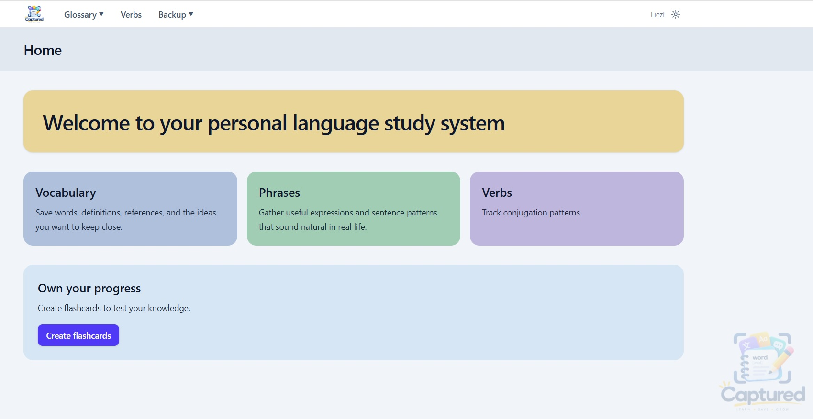

# Sprint 1 project reflections — Definition Capture

Turing College GitHub repository URL:  https://liezljvv74.github.io/definition-capture/

REFLECTION.md
1.	What I built and how I scoped it down
I built a “Definition Capture” app, where phrases and definitions can be captured and connected to each other.  The idea is based on a book I conceptualised to facilitate structured language learning.  The actual idea was to have the app listen to when text is copied and then automatically place it in the relevant list, but since that is beyond the scope of this sprint project, I toned it down and hope to implement that function later during the course. 
So the scope for this project was to create a static application that: -
•	Runs locally via npm run dev
•	Needs no deployment step or public URL
•	Uses no backend or user accounts
•	Preserves data through a browser
2.	The persistence decision
I used localStorage, because my data is currently simple lists, there is only one user, and there is no server needs to be synced.  
3.	One moment a Sprint 1 technique changed the outcome
Using the Next.js framework gave me a feeling of much more support than just telling the AI to start writing code.  I compare this with previous experience while exploring on my own before starting this course.   
4.	One thing that was harder than the plain-HTML app from the static-site lesson.
Figuring out how to start the app without having to tell Claude from the terminal to run it in the browser.  Claude eventually suggested to write a .cmd file that I can double click on to run the server.
5.	What I would keep or change next time
I am not sure yet.  I will probably keep the structure created by npx.  I am not sure how that might limit me in building more complex applications, though.  I will have to learn and experiment a bit more to get more comfortable with the concepts and way of work

Handed in
•	Turing College GitHub repository URL  
https://liezljvv74.github.io/definition-capture/
•	README.md  – Included as part of app documentation
•	CLAUDE.md  – Included as part of app documentation
•	docs/ folder – Included as part of app documentation 

App screenshot

